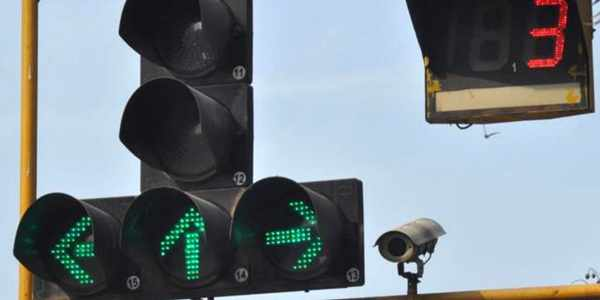
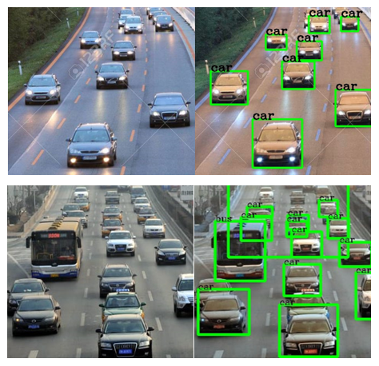

<p align="center">
 
</p>

<h1 align="center">Adaptive Traffic Signal Timer</h1>

<div align="center">

[](https://www.python.org/downloads/release/python-370/)
[](https://www.apache.org/licenses/LICENSE-2.0)

<h4>This Adaptive Traffic Signal Timer uses live images from the cameras at traffic junctions for traffic density calculation using YOLO object detection and sets the signal timers accordingly, thus reducing the traffic congestion on roads, providing faster transit to people, and reducing fuel consumption.</h4>

</div>

-----------------------------------------
### Inspiration

* Traffic congestion is becoming one of the critical issues with the increasing population and automobiles in cities. Traffic jams not only cause extra delay and stress for the drivers but also increase fuel consumption and air pollution. 

* According to the [TomTom Traffic Index](https://www.tomtom.com/en_gb/traffic-index/ranking/), 3 of the top 10 countries facing the most traffic congestion are in India viz. Mumbai, Bengaluru, and New Delhi.  People are compelled to spend hours stuck in traffic jams, wasting away their precious time commuting. Current traffic light controllers use a fixed timer and do not adapt according to the real-time traffic on the road.

* In an attempt to reduce traffic congestion, we developed an improved traffic management system in the form of a Computer Vision-based traffic light controller that can autonomously adapt to the traffic situation at the traffic signal. The proposed system sets the green signal time adaptively according to the traffic density at the signal and ensures that the direction with more traffic is allotted a green signal for a longer duration of time as compared to the direction with lesser traffic. 

------------------------------------------
### Implementation Details

This project can be broken down into 3 modules:

1. `Vehicle Detection Module` - This module is responsible for detecting the number of vehicles in the image received as input from the camera. More specifically, it will provide as output the number of vehicles of each vehicle class such as car, bike, bus, truck, and rickshaw.

2. `Signal Switching Algorithm` - This algorithm updates the red, green, and yellow times of all signals. These timers are set bases on the count of vehicles of each class received from the vehicle detection module and several other factors such as the number of lanes, average speed of each class of vehicle, etc. 

3. `Simulation Module` - A simulation is developed from scratch using [Pygame](https://www.pygame.org/news) library to simulate traffic signals and vehicles moving across a traffic intersection.

Read more about object detection model used, working of the algorithm, and development of simulation [here](./Adaptive_Traffic_Signal_Timer_Implementation_Details.pdf).

------------------------------------------
### Demo

* `Vehicle Detection`

<p align="center">
 
</p>

<br> 

* `Signal Switching Algorithm and Simulation`

<p align="center">
    
</p>

------------------------------------------
### Prerequisites

1. [Python 3.7](https://www.python.org/downloads/release/python-370/)
2. [Microsoft Visual C++ build tools](http://go.microsoft.com/fwlink/?LinkId=691126&fixForIE=.exe.) (For Windows only)

------------------------------------------
### Installation

* Step I: Clone the Repository
```sh
      $ git clone https://github.com/mihir-m-gandhi/Adaptive-Traffic-Signal-Timer
```

* Step II: Download the weights file from [here](https://drive.google.com/file/d/1flTehMwmGg-PMEeQCsDS2VWRLGzV6Wdo/view?usp=sharing) and place it in the Adaptive-Traffic-Signal-Timer/Code/YOLO/darkflow/bin directory

* Step III: Install the required packages
```sh
      # On the terminal, move into Adaptive-Traffic-Signal-Timer/Code/YOLO/darkflow directory
      $ cd Adaptive-Traffic-Signal-Timer/Code/YOLO/darkflow
      $ pip install -r requirements.txt
      $ python setup.py build_ext --inplace
```

* Step IV: Run the code
```sh
      # To run vehicle detection
      $ python vehicle_detection.py
      
      # To run simulation
      $ python simulation.py
```

------------------------------------------
### Dissemination

* This project was showcased at a national level project competition organized by [Government Polytechnic Mumbai](http://www.gpmumbai.ac.in/). View our presentation video [here](https://youtu.be/OssY5pzOyo0).

* Our paper based on this project was presented at 5th IEEE International Conference on Recent Advances and Innovations in Engineering - [ICRAIE 2020](http://www.icraie.poornima.org/) and published in IEEE Xplore. View the paper [here](https://ieeexplore.ieee.org/document/9358334).

------------------------------------------
### Contributors

Mihir Gandhi - [mihir-m-gandhi](https://github.com/mihir-m-gandhi)

Devansh Solanki - [devanshslnk](https://github.com/devanshslnk/)

Rutwij Daptardar - [RDmaverick](https://github.com/RDmaverick)

------------------------------------------
### Acknowledgement

We would like to extend our sincere thanks to our mentor Mrs. Nirmala Shinde Baloorkar for her kind help and valuable advice. Her support and constant supervision were imperative for the successful completion of this project. We would also like to express our special gratitude and thanks to Mrs. Kavita Kelkar, the subject-matter expert for this project, for her valuable inputs and guidance.   

------------------------------------------
### License
This project is licensed under the Apache License 2.0 - see the [LICENSE](./LICENSE) file for details.
